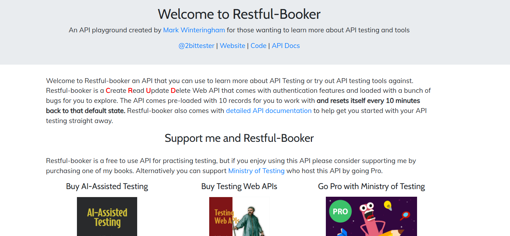
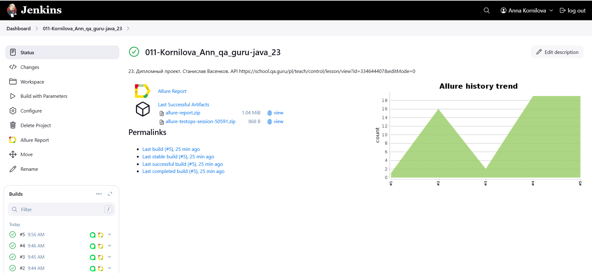
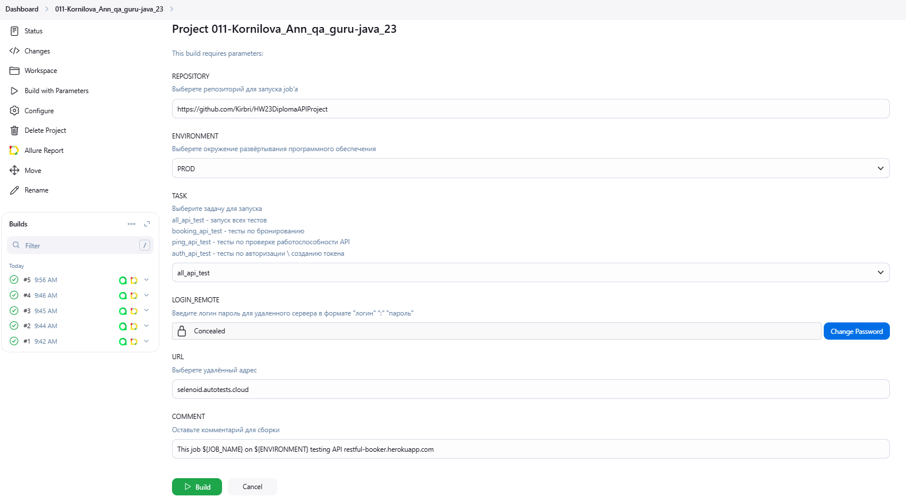
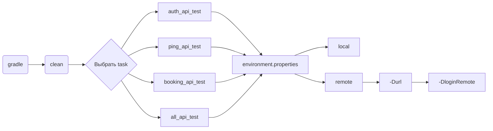
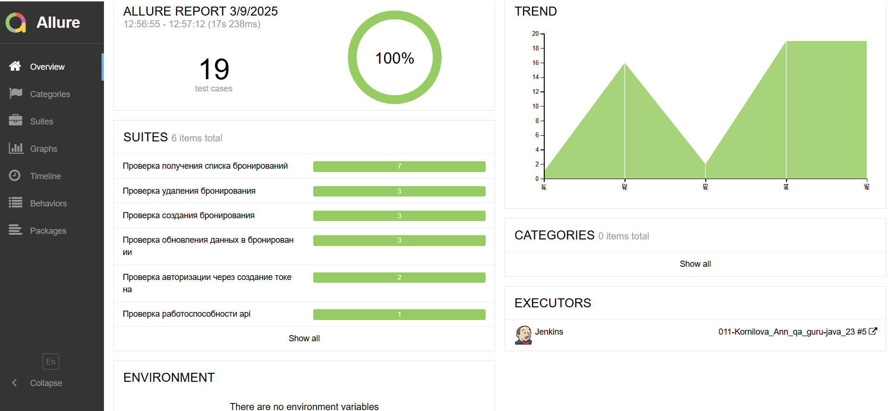
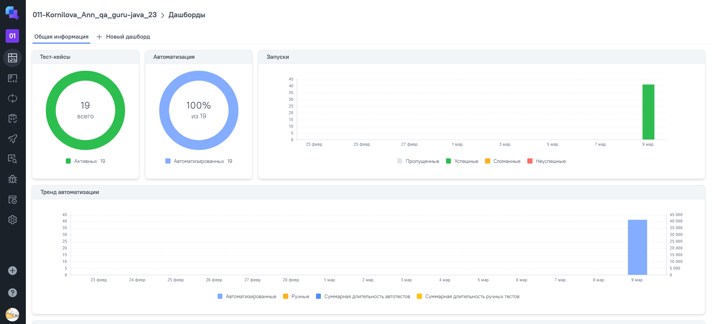
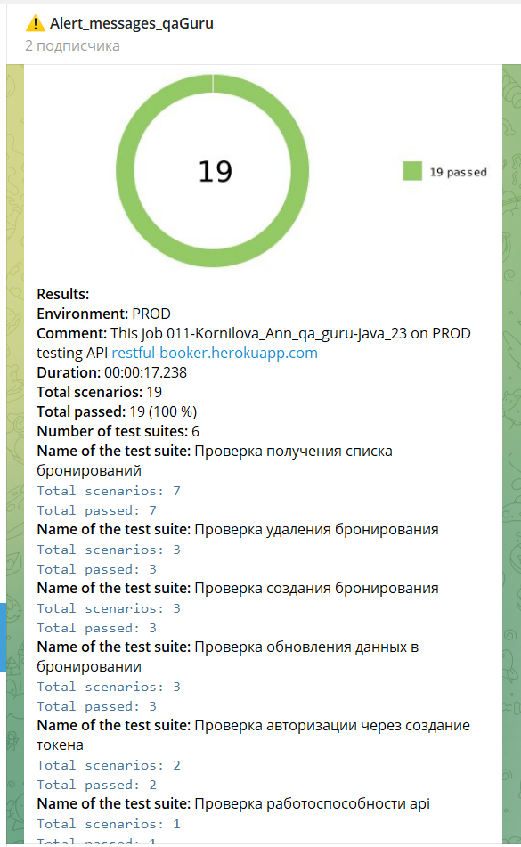
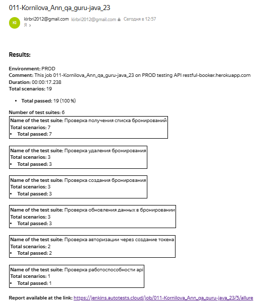

# <p align="center">Проект по автоматизации API тестовых сценариев для сайта [Restful-Booker]([https://www.avito.ru/](https://restful-booker.herokuapp.com/))</p>

> Restful-Booker - тестовая API-площадка по бронированию, созданная Марком Уинтерингемом.
>
<p align="center">

</p>

<a id="table_of_contents"></a>
## Содержание

* <a href="#tools">Технологии и инструменты</a>
* <a href="#project_goal">Цель проекта</a>
* <a href="#cases">Реализованные API тесты</a>
* <a href="#jenkins">Сборка в Jenkins</a>
* <a href="#jenkins_parameters">Параметризированная сборка в Jenkins</a>
* <a href="#console">Запуск тестов</a>
* <a href="#allure">Allure отчет</a>
* <a href="#allure-testops">Интеграция с Allure TestOps</a>
* <a href="#notifications">Уведомления</a>

___

<a id="tools"></a>
## <a name="Технологии и инструменты">Технологии и инструменты на проекте</a>

- Проект написан на **Java** с использованием фреймфворка **Selenide**
- Для модульного тестирования использовался **JUnit 5**
- <a href="#allure">Отчётность</a> представлена в **Allure Report**
- <a href="#jenkins">Непрерывная интеграция</a> и непрерывное развертывание реализовано через **Jenkins**
- **Telegram** и почтовый агент используются для получения <a href="#notifications">уведомлений</a>


| Логотип | Описание                                                                                                                                      |
| --- |-----------------------------------------------------------------------------------------------------------------------------------------------|
| <a href="https://www.jetbrains.com/idea/"> | IntelliJ IDEA — интегрированная среда разработки программного обеспечения.                                                                    |
| <a href="https://www.java.com/ru/"> | Java — строго типизированный объектно-ориентированный язык программирования общего назначения.                                                |
| <a href="https://github.com/"> | GitHub — крупнейший веб-сервис для хостинга IT-проектов и их совместной разработки.                                                           |
| <a href="https://junit.org/junit5/"> | JUnit — фреймворк для модульного тестирования программного обеспечения на языке Java.                                                         |
| <a href="https://gradle.org/"> | Gradle — система автоматической сборки.                                                                                                       |
| <a href="https://www.jenkins.io/"> | Jenkins — программная система предназначенная для обеспечения процесса непрерывной интеграции программного обеспечения.                       |
| <a href="https://github.com/allure-framework"> | Allure - фреймворк для создания простых и понятных отчётов автотестов.                                                                        |
| <a href="https://selenide.org/"> | Selenide - это фреймворк для автоматизированного тестирования веб-приложений на основе Selenium WebDriver.                                    |
| <a href="https://qameta.io/"> | Allure Testops - полноценное управление тестированием, ориентированное на автоматизацию, согласованное с DevOps.                              |
| <a href="https://telegram.org/">| Telegram — кроссплатформенный мессенджер.                                                                                                     |

<a href="#table_of_contents">Наверх</a>
____

<a id="project_goal"></a>
## <a name="Цель проекта">Цель проекта </a>

> <p>Проект является демонстрационным и включает в себя ряд автоматизированных API тестов, охватывающих различные аспекты функциональности, обеспечивая качество, надежность и стабильность работы сайта.</p>

<a href="#table_of_contents">Наверх</a>

 ____

<a id="cases"></a>
## <a name="Реализованные API тесты"> Реализованные API тесты </a>

- [x] Проверка авторизации через создание токена;
- [x] Проверка работоспособности API;
- [x] Проверка взаимодействия с сервисом броинрования.

<a href="#table_of_contents">Наверх</a>

____

<a id="jenkins"></a>
## <a name="Сборка в Jenkins"> Сборка в [Jenkins](https://jenkins.autotests.cloud/job/011-Kornilova_Ann_qa_guru-java_23/) </a>

Для запуска сборки необходимо перейти в раздел Build with Parameters и нажать кнопку Build

<p align="center">  
<a href="https://jenkins.autotests.cloud/job/011-Kornilova_Ann_qa_guru-java_23/"></a>  
</p>

<a id="jenkins_parameters"></a>
### <a name="Параметры сборки в Jenkins"> Параметры сборки в Jenkins </a>

- **REPOSITORY** - репозиторий источник данных для запуска тестов
- **TASK** - выбор группы тестов
- **USER_NAME ACCESS_KEY** - учётные данные от платформы browserstack
- **DEVICE_NAME** - модель телефона

<p align="center">  
<a href="https://jenkins.autotests.cloud/job/011-Kornilova_Ann_qa_guru-java_23/build?delay=0sec"></a>  
</p>

<a href="#table_of_contents">Наверх</a>

_____
<a id="console"></a>
##  <a name="Команды для запуска тестов"> Команды для запуска тестов </a>

> [!NOTE]
>
> **[Иструкция](https://autotest.how/appium-setup-for-local-android-tutorial-md) по настройке и запуску**
>
> Для локального запуска необходимо установить:
> - [Java](https://github.com/qa-guru/knowledge-base/wiki/%D0%98%D0%BD%D1%81%D1%82%D1%80%D1%83%D0%BC%D0%B5%D0%BD%D1%82%D1%8B:-Java),
> - [Gradle](https://github.com/qa-guru/knowledge-base/wiki/%D0%98%D0%BD%D1%81%D1%82%D1%80%D1%83%D0%BC%D0%B5%D0%BD%D1%82%D1%8B:-Gradle),
> - Cреда разработки, например, [IntelliJ IDEA](https://github.com/qa-guru/knowledge-base/wiki/%D0%98%D0%BD%D1%81%D1%82%D1%80%D1%83%D0%BC%D0%B5%D0%BD%D1%82%D1%8B:-IntelliJ-IDEA)

### Допустимые комбинации



### Локально

**Локальный запуск с параметрами по умолчанию**

```bash  
gradle clean {task}
```

### Удалённо

**Пример локального запуска с указанием среды выполнения**

```bash  
clean
booking_api_test
"-Durl=selenoid.autotests.cloud" -DloginRemote=login:password
```

**Пример удалённого запуск через *Jenkins***
```bash
clean
${TASK}
-Durl=${URL} -DloginRemote=${LOGIN_REMOTE}
```

<a href="#table_of_contents">Наверх</a>

_____

<a id="allure"></a>
## <a name="Allure отчет">Allure [отчет](https://jenkins.autotests.cloud/job/011-Kornilova_Ann_qa_guru-java_23/allure/)</a>

### Основная страница отчёта

<p align="center">  
  
</p>  

___

<a id="allure-testops"></a>
## <a name="Интеграция с Allure TestOps">Интеграция с [Allure TestOps](https://allure.autotests.cloud/project/4661/dashboards)</a>

### Allure TestOps Dashboard

<p align="center">  
  
</p>  
____

<a id="notifications"></a>
## <a name="Notifications"> Уведомления </a>


###  <a name="Telegram"> Уведомление в Telegram </a>

<p align="center">  
  
</p>

<a href="#table_of_contents">Наверх</a>


###  <a name="Mail"> Уведомление на почту </a>

<p align="center">  
  
</p>

<a href="#table_of_contents">Наверх</a>